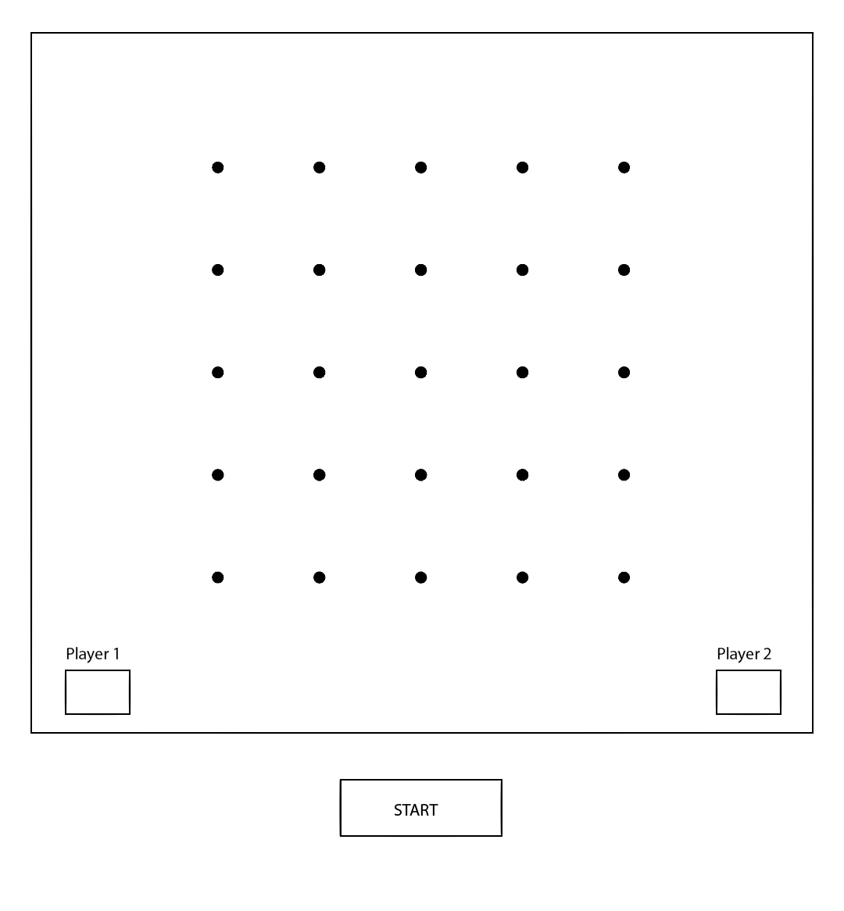

# Dot Game

## How to Play Dots

* Game begins with 4 rows with 4 columns of dots each
*  Player one connects two dots
* Player two connects two dots
* The objective is to complete a box
* When a player connects the dots to make square that user's name goes in the box and they get another turn
* Game ends when all dots are connected, gameboard is all boxes
* Winner is determined by player with the most boxes, a tie is possible

## Necessary Features

* Game Board
* Collect player names
* Click event (and hover is feature in place) based on X/Y orientation of each box that creates a border on that side (Remove hover event on the border/side selected if feature in place)
* Conditional to check if border selection completes/closes the box
* If box is completed - that player's initials placed inside that box, point assigned to that player, player goes again until unable to create another box

## Plus
* Hover Event on any border before selected
* Keep user score with visible counter
* Fancy affects

## Project Issues and Shortcomings
If I had additional time, these are the parts of the game I would change:
* Based on the targeting of all the different mouse locations for both hover and click, my code is embarrassingly bloated. I tried to create a function that could use the coordinates to output both the hover and click events, but I couldn't figure it out. I would have used a good partner with experience to help me dry up the code, and I also couldn't figure out how to remove a click event from the side I was working on.
* Click function can be wonky based on how your trackpad is set up. X and Y locations and how hover is applied can also be finicky. You have to be very intentional. 
* I would have liked to include a color picker to allow the players to choose their own colors, as well as the gameboard. I think that would add a fun interactity to the game.
* I would have liked to include a graceful way of collecting both the player's name and the color choice. If I had more time these would would be features I would like to have pursued. I kept the variables as loose as possible to allow later implemenation of this idea.
* I really wanted the hover affect on the border to expand out from center, but as this affect is applied to the ::after psuedo element, try as I might I couldn't figure out how to manipulate it on both the X & Y access, and there was a lot of styling issues as well. I believe it would require a different approach to how the gameboard was initially designed/created.

## Additional Resources and Research

Special thanks to the following for their inspiration, encouragement, or help in completeing this project:

* [Css Tricks](https://css-tricks.com/snippets/jquery/get-x-y-mouse-coordinates/) for helping me figure out how to define my mouse coordinates with jquery in relation to the specific box and not the page itself.
* Bobby who helped sort the issue with loop for the winning box, without judging my superfluous code.
* Mikey whose super human ability to traverse the DOM, specifically when it came to targeting the box in the row above the current click, kept me from drastic measures.
* Celeste who is just a calming presence to sit next to, and provided branch names for the wild animal alphabet.
* [HTML Goodies](http://www.htmlgoodies.com/tutorials/getting_started/article.php/3479551) (courtesy of a Fizal) for the suggesting on how to refresh a page when I couldn't figure out how to remove my event listeners.
* To Nancy my upstairs neighbor, an artist who chose the default colors for the gameboard and players.

### Libraries, tools,  etc

[Sass](http://sass-lang.com/), [Jquery](http://jquery.com/), [Google Fonts](https://www.google.com/fonts), [Zurb Foundation](http://foundation.zurb.com/), [Stack Overflow](http://stackoverflow.com/), [Animate CSS](https://daneden.github.io/animate.css/), [JS HINT](http://jshint.com/), [JS Beautify](http://jsbeautifier.org/), [HTML beautifier](http://www.cleancss.com/html-beautify/), [MarkDown Editor](http://dillinger.io/);

